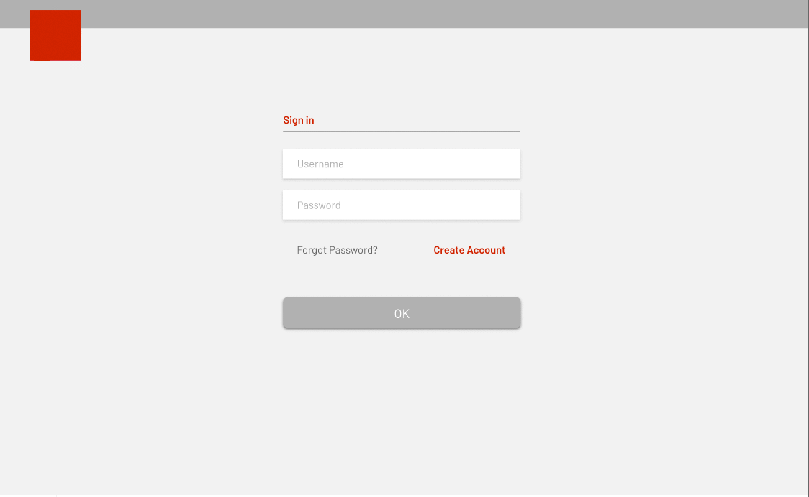

# Customer Interests Understanding
ReactJS Frontend of media analytics software tool

## Install the latest nodejs version

## Create app
npm install create-react-app

create-react-app Frontend

## Install requirements

npm install react redux history react-redux redux-thunk redux-logger react-datepicker moment react-dropdown-tree-select react-select react-responsive-carousel react-dom react-compound-slider react-router-dom merge-json prop-types d3

## Run app
cd Frontend

npm start

The backend code which includes RESTful APIs is written in python 3
